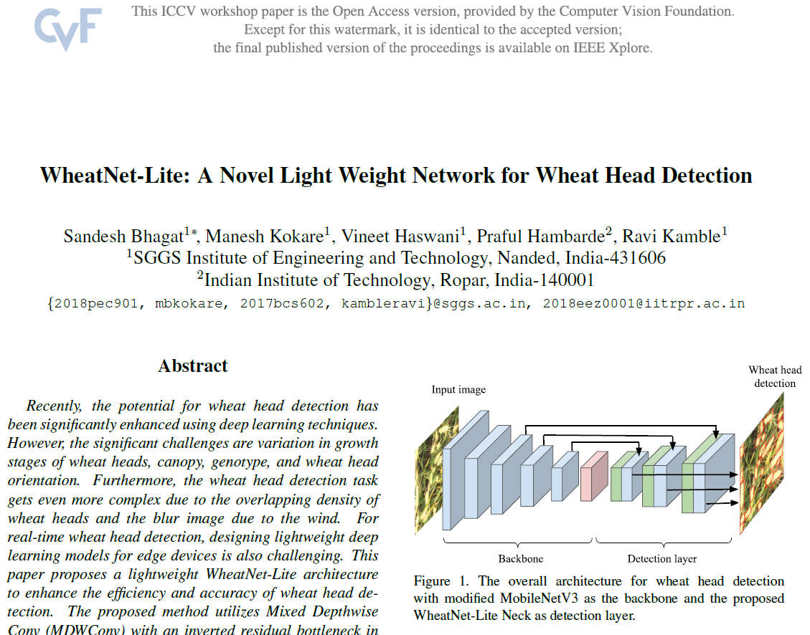

# Paper Accepted at Internactional Conferance on Computer Vision (ICCVW-2021)

Accepted paper Link: https://openaccess.thecvf.com/content/ICCV2021W/CVPPA/papers/Bhagat_WheatNet-Lite_A_Novel_Light_Weight_Network_for_Wheat_Head_Detection_ICCVW_2021_paper.pdf

## Contributions

- Design lite weight model for wheaat head detection  
- Proposed ACID dataset with bounding box annotations 
- Annoations done using [LabelImg tool](https://github.com/tzutalin/labelImg)
- Results validats on three datasets as GWHD, SPIKE and ACID Dataset.

# Screenshot of ICCVw-2021 paper

# Qualitative results

# Quantitative results

Code referance:
- Website: https://pylessons.com/
- GitHub: https://github.com/pythonlessons/TensorFlow-2.x-YOLOv3
